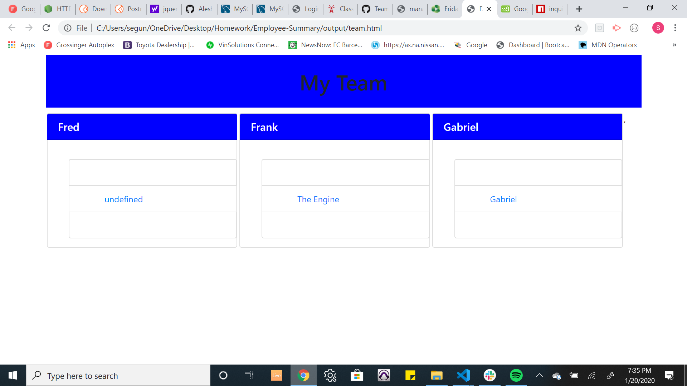
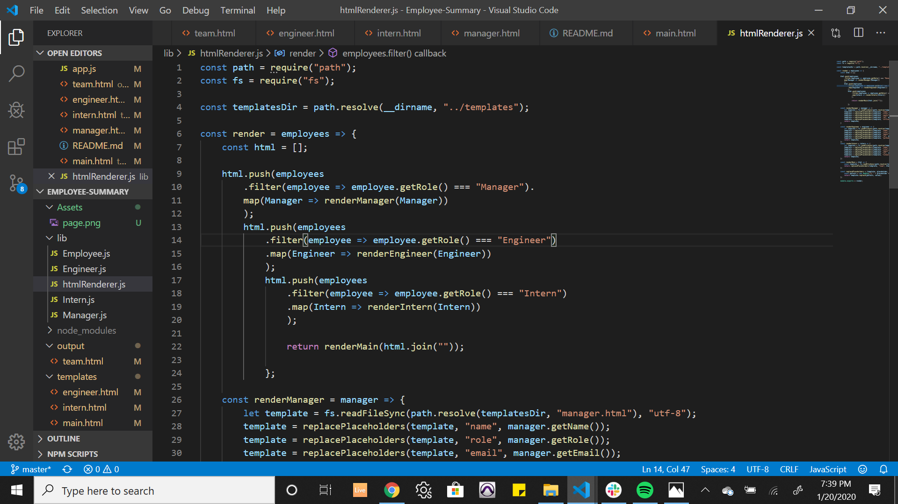
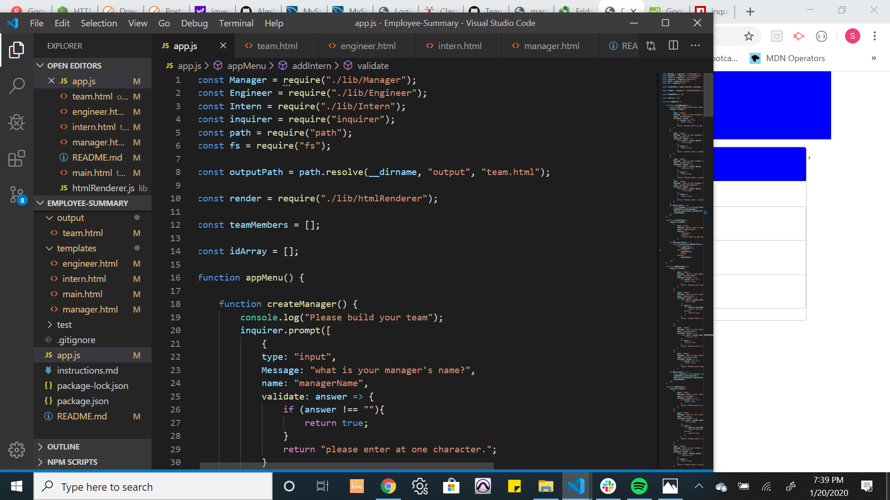

# Employee-Summary
As a product manager, I am required to meet with stakeholders every now and then, not just to give updates about projects, but also to give neccessary updates about members of the development team.

I wrote this program in order to be able to easily have access to each member of my teams's basic infomation like: email, id-number, github username and intern's school

    I used the "inquirer" npm package to prompt some information to be entered, these information is then used to generate a simple html page which will display the information entered in a simple way.

    
    I was able to make some changes to make my code pass the tests.

    I was not able to get all the information to show on my html page and I got some errors that I couldn't fix. I will keep on working on these errors.

## Screenshot of the test

## Still working on the page

## Some code snippet:

## Built with
* VScode

## Usage
* To generate html file containing basic information about my development team.

## Contact
* Segun Alesinloye 
* segunalesh@gmail.com 
* Github repo link: https://github.com/Aleshsparrow

## Acknowledgement
* Bootstrap
* Inquirer npm package
* Fs npm package

